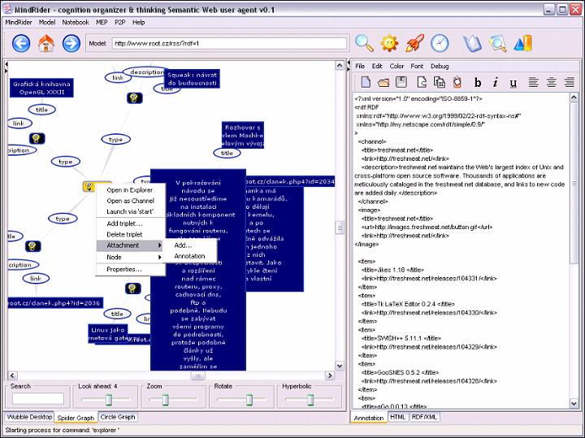
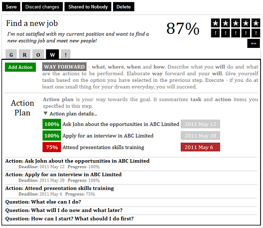

# History <!-- Metadata: type: Outline; created: 2018-02-23 10:56:27; reads: 98; read: 2018-05-10 12:51:32; revision: 98; modified: 2018-05-10 12:51:32; importance: 0/5; urgency: 0/5; -->

[MindForger](https://www.mindforger.com) is my fourth attempt to implement a good knowledge management
tool. Therefore it has relatively long history - it is successor of
RDF Spiders, MindRaider and Coaching Notebook. Actually it's a bit more 
complicated...
# RDF Spiders <!-- Metadata: type: Note; created: 2018-03-18 09:12:54; reads: 38; read: 2018-05-10 12:48:36; revision: 36; modified: 2018-05-10 12:48:36; -->

[RDF Spiders](http://mindraider.sourceforge.net/gallery/mindraider-incubator/index.html) was 
a 90s Java-based application which visualized RDF models. RDF was a core format specification
of the Semantic Web. 

RDF Spiders can be seen as a **mind mapping** application with native 
RDF runtime interoperable with other Semantic Web applications.
It required good knowledge of RDF which limited 
number of potential users. This is why I decided to implement more user friendly 
[MindRaider](#mindraider).
# MindRaider <!-- Metadata: type: Note; created: 2018-03-18 09:12:59; reads: 17; read: 2018-04-24 17:18:33; revision: 4; modified: 2018-04-24 17:18:33; -->

[MindRaider](http://mindraider.sourceforge.net/) is a 90s Java-based 
Semantic Web desktop application which is an outliner with RDF runtime. 
MindRaider was decently successful project with 100.000+ downloads. However 
it became morally obsolete and I didn't want to invest time to deliver new features 
on top of dying UI and runtime technology. Therefore I decided to start a new project.
# Coaching Notebook <!-- Metadata: type: Note; created: 2018-03-18 09:13:06; reads: 13; read: 2018-03-18 09:19:34; revision: 8; modified: 2018-03-18 09:19:34; -->

[CoachingNotebook](http://web.mindforger.com/) is a successor of MindRaider. 
At the beginning it was a combination of an auto-coaching tool and an outliner.
Implemented on Google App Engine PaaS (GAE) it served as a way to learn trendy
technologies. After a few years I determined
that coaching aspect of MindForger has questionable future, application is too big,
complex and basically all coaching features can be realized using a mature outliner.

Therefore I decided to split CoachingNotebook project to two focused applications:
auto-coaching and outliner. I opensourced CoachingNotebook (w/o outliner) 
on [GitHub](https://github.com/dvorka/coaching-notebook) under Apache license.

Then I decided to return back to the roots.
# MindForger <!-- Metadata: type: Note; tags: cool; created: 2018-03-18 09:14:07; reads: 6; read: 2018-05-10 12:51:32; revision: 5; modified: 2018-05-10 12:51:32; -->

[MindForger](https://github.com/dvorka/mindforger) is an desktop
application that is built using experience from all my past projects. 
It aims to finally go beyond outliner and become definitive human mind inspired *personal* knowledge management 
tool running on desktop. Key features include human mind like capabilities, security, sharing and good overall performance.
